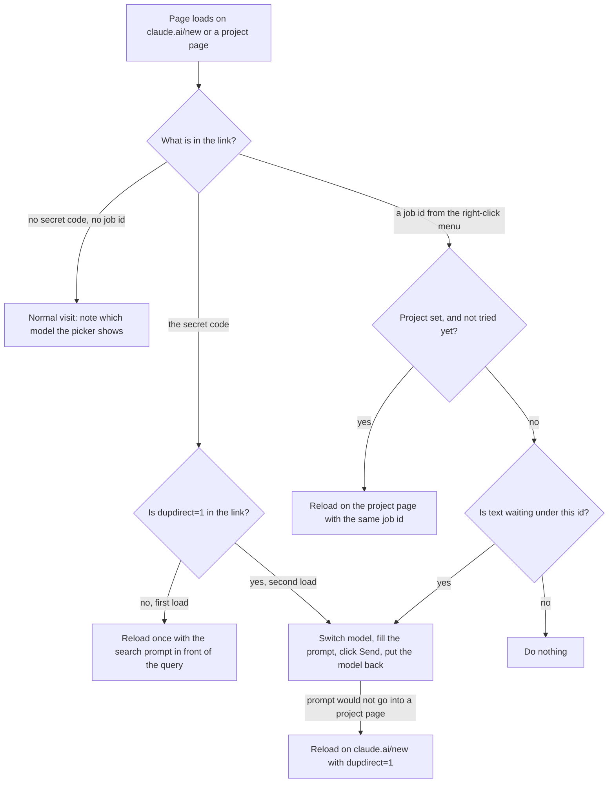

# Claude as Default Search

Type in the address bar, hit Enter, and the question goes straight to Claude on **Sonnet**,
sent automatically. Your regular claude.ai chats stay on your usual model (Opus, say).

Select text on any page, right-click, and under **Claude** choose **Search with Claude**,
**Ask about this** or **Summarize**. A new tab opens next to the page and the request is sent for you.

The prompts it sends, the model it uses and the project it files chats in can be changed on the
extension's options page.

Works in Brave and Chrome. Not affiliated with Anthropic.

## Why this exists

- Brave won't let a custom search engine you add by hand become the default ("Make default" is grayed out).
  Extensions can set it, so this one does.
- `claude.ai/new?q=...` fills in the prompt but no longer sends it. It shows a "use caution" banner instead,
  because a link could plant a malicious prompt. This extension presses send for you, but **only** on searches
  from your own address bar (see Security).
- claude.ai has no URL parameter for the model, so the extension sets the model itself.

## How it compares

| | **claude-default-search** | [Claude Search](https://chromewebstore.google.com/detail/claude-search/fjfcehgcbhdcfgempfoafdolienldgbe) | [Claude AI Search](https://chromewebstore.google.com/detail/claude-ai-search/mdpjfhahomdebomifakfombhdjnbahhi) | [Your AI in Search Bar](https://chromewebstore.google.com/detail/your-ai-in-search-bar-cha/hfcilidehpkcnlbplpfkcodijcmoamjn) | [AI Omnibox Search](https://chromewebstore.google.com/detail/ai-omnibox-search/eoglpbkepflokocokpeadckokjpjnice) |
|---|:-:|:-:|:-:|:-:|:-:|
| Plain address-bar search (no keyword) | ✅ | ✅ | ✅ | ✅ | ❌ (`ai` + space) |
| Sends automatically | ✅ | ✅ | ✅ | ✅ | — |
| Choose the model searches run on (Sonnet by default) | ✅ | — | — | — | — |
| Restores your usual model after sending | ✅ | — | — | — | — |
| Send searches to a Claude Project | ✅ | — | — | — | — |
| Right-click selected text to search, ask or summarize | ✅ | — | ✅ (ask, summarize) | — | — |
| Source on GitHub | ✅ | — | [✅](https://github.com/farhansrambiyan/claude-ai-search-extension) | — | — |

<sub>Based on each extension's Chrome Web Store listing as of October 2026, and on the GitHub source where one is linked; "—" means the listing doesn't mention it. Corrections welcome via an issue.</sub>

## Install

1. Download or clone this repo.
2. Build your personal copy (it generates your own secret code):
   - Windows: `powershell -ExecutionPolicy Bypass -File .\setup.ps1`
   - Mac/Linux: `./setup.sh`
3. Go to `brave://extensions` (or `chrome://extensions`), turn on **Developer mode**, click **Load unpacked**,
   and pick the `extension` folder.
4. If the browser asks whether to keep the search engine change, click **Keep**.

Keep the folder where it is: the browser loads the extension from it on every start.
To undo everything, remove the extension.

### Optional: file searches in a project

To keep searches out of your main chat list, make a project on claude.ai (say "Web Search"), copy
`.env.example` to `.env`, and paste the project's link:

```
PROJECT_URL=https://claude.ai/project/<id>
```

Run setup again and reload the extension. Searches and right-click requests now start inside that
project. With no `.env`, or an empty `PROJECT_URL`, they are ordinary chats.

You can also set or change the project later without rebuilding: paste its link on the options page.

Everything the extension sends carries its own instructions, so the project needs no setup. If you also
want to search by typing straight into the project on claude.ai, paste this into the project's instructions:

```
Chats in this project come from my browser. Most are web searches.

Unless the first message says it is not a search query, treat it as one. It may be a few keywords, a site name or a full question. Search the web unless the answer can't have changed recently.

How to answer a search:
- Lead with the answer in a sentence or two.
- Then give the most useful results as a short list of links, each with a line on what it is.
- Link inline as well: wherever the text names a page, product, person or source, make that name the hyperlink, so I can click straight from the sentence.
- If I'm clearly just trying to get to a site, give me its link first.
- Don't ask what I meant. Go with the most likely reading and mention the others only if they'd change the answer.

If the first message says it is not a search query, do what it asks instead.

Later messages in the same chat are ordinary follow-ups.
```

### Options

Open the extension's **Details** in `brave://extensions` and click **Extension options**. You can change:

- the **project link**, which overrides the one chosen at setup;
- the **model** searches and right-click requests run on (Sonnet by default), or "my usual model" to
  leave the model alone;
- the **search prompt** sent with every address-bar search (`{query}` is what you typed);
- the **Ask** and **Summarize** prompts (`{text}` is the selection, `{url}` the page it was on).

An empty box means the built-in default. Changes apply to the next search; there is nothing to reload.

## How it works

*Last checked against the code on 2026-10-09, at commit 314f17c.*

The extension is plain JavaScript with no build tools and no libraries. It never talks to a server of its own. Everything it does happens in your browser, on claude.ai's own pages, using your existing claude.ai login.

It does three things claude.ai has no setting for: it makes Claude the default search engine, it presses Send for you, and it switches the model for that one message and then switches it back.

### The pieces

| File | What it is | What it does |
|---|---|---|
| `manifest.json` | Manifest V3 | Sets the default search engine to `https://claude.ai/new?q={searchTerms}&dupsearch=<your secret code>`, and registers the other files. Permissions: `contextMenus`, `storage`. |
| `autosend.js` | Content script | Runs at the very start of every load of `claude.ai/new*` and `claude.ai/project/*`. Decides what kind of visit this is, then fills the prompt, switches the model and clicks Send. |
| `background.js` | Service worker | Adds the right-click menu, opens the new tab, and holds the selected text until the tab has sent it. |
| `defaults.js` | Shared constants | The default prompts, the model list, the project id chosen at setup, and `fillPrompt`, which puts the values into a prompt. Loaded by both the content script and the options page. |
| `options.html`, `options.js` | Options page | Edits the project link, the model and the three prompts. |
| `setup.sh`, `setup.ps1` | Build scripts | Copy `src/` to `extension/` with your secret code and project id filled in. |

### What `autosend.js` does when a page loads

The script looks at the link the page was opened with and takes one of three paths.



A link with the wrong code, or no code, is a normal visit. A link with the right code but an empty query does nothing.

### An address-bar search, step by step

1. You type in the address bar. The browser opens `claude.ai/new?q=<what you typed>&dupsearch=<code>`.
2. `autosend.js` sees the code. It builds the full prompt (the search prompt with your query in place of `{query}`) and reloads once, with that prompt in `q` and `dupdirect=1` added. With a project set, the reload goes to `claude.ai/project/<id>`; otherwise to `claude.ai/new`.
3. On the second load it reads your usual model from localStorage (Opus 5.5 if none has been noted yet).
4. It sets the account's model to the search model with `PATCH /api/organizations/<org>/model_selector_state/chat`. The org id comes from claude.ai's `lastActiveOrg` cookie.
5. It gets the prompt into the box:
   - On `claude.ai/new`, claude.ai fills the box from `q`. The script waits up to 15 seconds for text to appear.
   - On a project page, nothing fills the box, so the script types the prompt itself (next section).
6. It waits up to 15 seconds for an enabled **Send message** button.
7. If the model picker's label does not name the search model, it opens the picker and clicks the menu item with that name.
8. It clicks Send.
9. It waits up to 8 seconds for the address to change to `/chat/...`, waits 1 more second, and sets the account's model back to your usual one.

With the model set to "my usual model", steps 4, 7 and 9 are skipped.

If the prompt or the Send button never shows up, nothing is sent, and the model is still put back.

### A right-click request, step by step

**Search with Claude** is an address-bar search: the selection is squeezed onto one line and opened with the same link and code.

**Ask about this** and **Summarize** work differently, because the selected text never goes in a link:

1. `background.js` makes a random id and stores `{mode, text, page address}` under `job-<id>` in the extension's session storage.
2. It opens `claude.ai/new?dupjob=<id>` in a new tab next to the page you were on.
3. `autosend.js` sees the id. With a project set, it reloads on the project page with the same id.
4. It asks the background script for the text by message. The background script answers only messages from this extension.
5. If nothing is waiting under that id, the script stops. That is what happens to a `dupjob` link from anywhere else.
6. It fills the Ask or Summarize prompt and types it into the box. This is typed on `claude.ai/new` too, since the text is not in the link.
7. It switches the model, clicks Send and puts the model back, the same way a search does.
8. Once Send is clicked, it tells the background script, which deletes the stored text.

`fillPrompt` replaces the placeholders in one pass, so selected text that itself contains `{text}` or `{url}` is sent as written. A saved prompt that leaves out its main placeholder still gets the value, on its own line at the end.

### Typing into the prompt box

The box is a rich-text editor, so setting its text directly would not register. The script does what a keyboard would:

1. Find the visible element labelled "Write your prompt to Claude" and focus it.
2. Select all, then insert the prompt one line at a time with `execCommand("insertText")`, with `insertParagraph` between lines.
3. If the text is not there afterwards, send the box a paste event carrying the whole prompt.
4. Wait 250 ms and check again, because the page can wipe the box while it finishes loading. Repeat for up to 10 seconds.

Runs of spaces are collapsed to one space, and three or more line breaks become two.

If this fails on a project page, the script writes a note to localStorage (which methods it tried and which inputs were on the page) and reloads on `claude.ai/new` with `dupdirect=1`, so the request still goes out as an ordinary chat.

### Where settings come from

Each value is taken from the first place that has it.

| Setting | 1. Options page | 2. Setup | 3. Built in |
|---|---|---|---|
| Project | The project link you saved | `PROJECT_URL` in `.env`, baked in by the setup script | None: ordinary chats |
| Model | The model you picked, or "my usual model" | | Sonnet 5.5 |
| Search, Ask and Summarize prompts | Your saved text | | `DEFAULTS` in `defaults.js` |

The options page saves an empty value for anything that still matches the default, so a later change to the defaults reaches you. A saved model that is not in `MODELS` counts as the default.

The model list on the options page is `MODELS` in `src/defaults.js`: Sonnet 5.5, Haiku 4.5, Opus 5.5 and Fable 5.1. All four were tried against claude.ai in October 2026.

### What is stored, and where

| Store | Key | Holds | Lives until |
|---|---|---|---|
| Extension storage, local | `projectUrl`, `model`, `preamble`, `ask`, `summarize` | What you saved on the options page | You change it or remove the extension |
| Extension storage, session (memory only) | `job-<id>` | Selected text, the mode and the page address for one right-click request | Send is clicked, or the browser closes |
| claude.ai's localStorage | `dupsearch-usual-model` | The model id to put back after a search | Overwritten on your next normal visit |
| claude.ai's localStorage | `dupsearch-project-miss` | A note from the last time typing into a project page failed | Overwritten by the next failure |
| Your claude.ai account | model picker state | The model new chats open on. Changed for a search, then changed back. | |

The usual model is learned from normal visits: the script reads the picker's label (for example "Model: Opus 5.5") and turns it into an id (`claude-opus-5-5`). A page showing the search model is not noted, because it may be a search in progress.

### How the secret code gets in

The source has two placeholders, `__TOKEN__` and `__PROJECT__`. The setup scripts make 12 random bytes (24 hex characters), then copy every file in `src/` to `extension/` with the placeholders replaced. The code ends up in three files: the search link in `manifest.json`, `background.js` and `autosend.js`.

`extension/` and `.env` are in `.gitignore`, so a built copy and its code are never committed. Running setup again makes a new code.

### Decisions and what they cost

| Decision | What it costs |
|---|---|
| A secret code per install, baked in at build time. Only links carrying it are sent automatically. | There is no ready-made package to install: everyone runs setup. The code is part of the search link, so it is in the browser's history. |
| The search prompt is added by reloading with it in `q`, because claude.ai fills the prompt from the link. | One extra page load per search, and the prompt shows above your query in the chat. |
| The model is switched on the account, with the request claude.ai's own picker makes, and switched back after sending. | The call is undocumented. The switch is account-wide until the switch back, so a chat opened elsewhere in that window can start on the search model. If the tab closes before the switch back, the account stays on the search model. |
| The usual model is learned by reading the picker's label on normal visits. | Until a normal visit has been seen, the model put back is Opus 5.5. |
| Selected text waits in the extension under a one-time id and is fetched by message. | It needs the service worker and the `storage` permission. Text that is never sent stays in memory until the browser closes. |
| Page elements are found by their labels ("Model: ...", "Send message", "Write your prompt to Claude"). | A label change on claude.ai stops that step. The tests cannot see such a change. |
| No build tools: the setup scripts are a text replace. | There are two scripts to keep in step, and only `setup.sh` is covered by the tests. |
| An options value equal to the default is saved as empty. | You cannot pin today's default text against a later change. |

## Security

- Each install gets its own random secret code. Only searches from your address bar carry it.
  A link on any other site won't have it, so claude.ai's normal "use caution" stop still applies.
  Don't share your built `extension` folder; share this repo and let people run setup.
- A right-click request can't be forged by a link either: the selected text never travels in the link,
  only a one-time id, and an id with no text waiting for it does nothing.
- The extension asks for two permissions: `contextMenus` for the right-click menu, and `storage` to keep
  your options and to hold the selected text until it has been sent (that part is in memory only).
  It only runs on `https://claude.ai/new*`
  and `https://claude.ai/project/*`, and only acts on a project page when a search sent it there.
- It sends nothing anywhere except claude.ai: the model-picker request and the prompt itself. For Ask and
  Summarize, the prompt includes the address of the page you selected the text on.

## Limits

- It depends on claude.ai's page labels ("Model: ...", "Send message") and an undocumented API call.
  If claude.ai changes those, auto-send or the model switch can stop working. The search itself still
  lands in Claude; you just press Enter.
- Search-to-send takes about 2 seconds, mostly claude.ai loading.
- The search prompt is part of the message, so it shows above your query in the chat.
- If you open a new chat within about a second of a search, it may start on Sonnet.

## Tests

```
uv venv && uv pip install pytest playwright
.venv/bin/playwright install chromium
.venv/bin/python -m pytest tests
```

The tests run the content script in headless Chromium against a stand-in for claude.ai, and run
`setup.sh` against each kind of `.env`. They need network access (the stand-in's editor loads from esm.sh).
They show the script does what it should if claude.ai behaves as it did when they were written; they
can't tell you when claude.ai changes.
